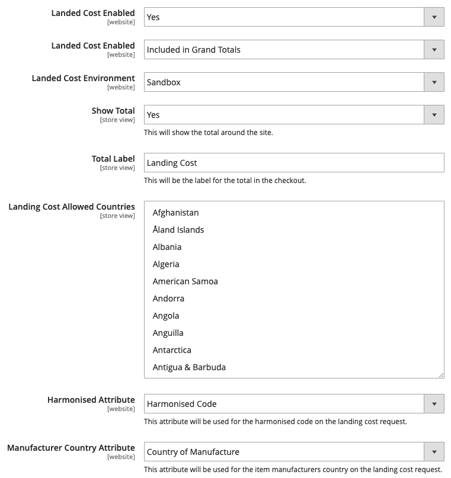

# GFS (Global Freight Solutions) Duty and Taxes Costs Calculator - Magento 2 Module

This module provides the facility to add an additional Duty and Taxes costs for the Global Freight Solutions for Magento 2.

## Version:
1.0.0

## Developers:
Global Freight Solutions - https://github.com/GlobalFreightSolutions

## Installation

To use this module in your Magento 2 store instance, you will need to either install the the module via composer or add the module via `app/code/JustShout/GfsLandedCost`.
1. Run the module enabling command `php magento module:enable JustShout_GfsLandedCost`
2. Run the upgrade command with `php magento setup:upgrade`
3. Run the static content command with the stores language so if its uk english it would be `php magento setup:static-content:deploy en_GB`

For a more in-depth guide of how to install the module from the Magento 2 Marketplace please visit https://devdocs.magento.com/guides/v2.3/comp-mgr/install-extensions.html

## User Guide

Before using the module. Please ensure that the shipping origin is setup for your store. The setting for this in in the admin configuration under Sales > Shipping Settings > Origin and the country field.

To setup the shipping module, log into your admin panel and navigate to your configuration by going to STORES > Settings > Configuration and then going to Sales > Shipping Methods, and after doing this, you will be able to see the GFS tab.

For more information on the Duty and Taxes, you can find it at https://developer.gfsdeliver.com/info/documentation/gfs-checkout-duties-and-taxes-calculator/overview/.